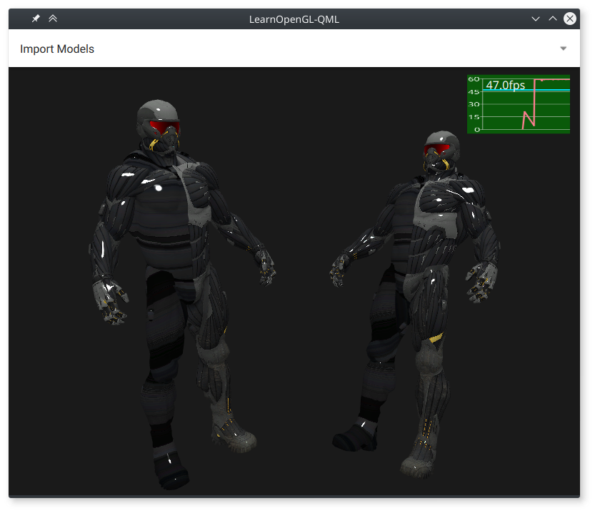
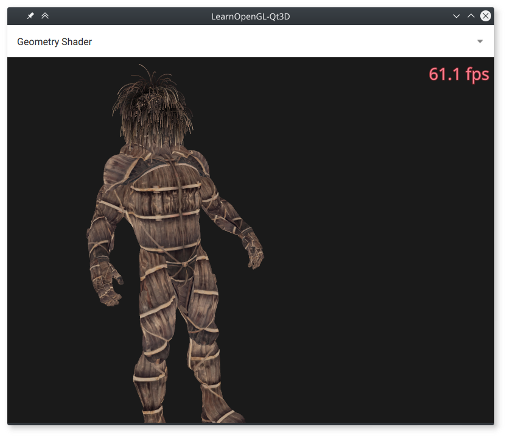
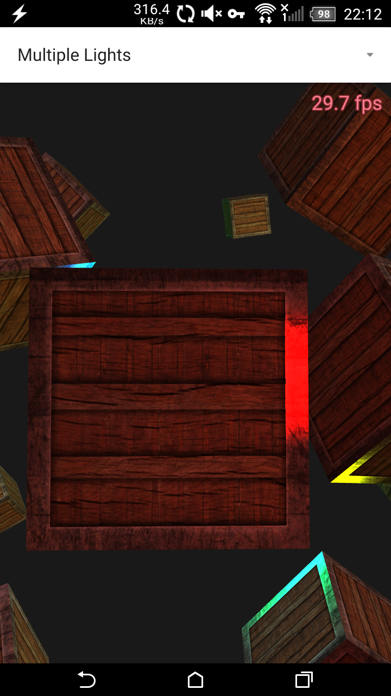

LearnOpenGL-Qt3D
================

［相关资源］

- https://learnopengl.com/                          : OpenGL3.3教材，含很多理论知识，用c++写的。
- https://github.com/LearnOpenGL-CN/LearnOpenGL-CN  : 中文翻译
- https://github.com/MidoriYakumo/learnopengl-qt3d  : 用QtQml3D实现的例子，未完成。
- https://github.com/jjzhang166/learnopengl-qt3d    : fork的，多了些例子。

［注意］

- 本项目fork自：https://github.com/MidoriYakumo/learnopengl-qt3d
- 本项目尚未完成。Qt3D仍未完善，有很多例程用Qt3D 善写不出来。
- 里面有很多的Qt3D Shader可供学习。
- 原git中需要另行下载的资源在本git中已经下载，可直接用 QmlScene 运行。


[以下为原始说明，有空改掉]

Qt3D version of [LearnOpenGL](http://learnopengl.com/) examples, currently works with Qt5.8. I created this repo aiming to understand how Qt3D works.


Pure QML version, use qmlscene to run with default OpenGL Context:

~~**Try it with Qt5.7+:**~~

```shell
	qmlscene -I https://raw.githubusercontent.com/MidoriYakumo/qml-virtualkey/master/ https://raw.githubusercontent.com/MidoriYakumo/learnopengl-qt3d/master/qml/app.qml
```



Compiled version, context set to GL4.3(Desktop)/GLES3.0(Mobile):





How to launch
-------------

learnopengl-qt3d can be launched from either qmlscene or compiled binary file.

Main qml file for qmlscene/binary/QmlCreator:

-	app.qml: main window with line chart FPS display

-	main.qml: QuickItem as root + text FPS display

With one keyword as arguments you can specify the sample to be launched:

-	qmlscene skybox app.qml
-	./learnopengl-qt3d geometry

Notes
-----

-	Some large assets from the website is downloaded by qmake script(\*nix only), connection is required at the first build or after updated. Use **CONFIG += no_assets** to skip and enable local filesystem routing(may lead to crash). See [main.cpp](./main.cpp), [assets.pri](./assets.pri), [Resources.qml](./qml/Components/Resources.qml) for details.

-	**leanopengl uses a little different lighting model from Qt3D default model, to rendering models for a better result, please slightly modify the ka, kd in mtl files**

-	run qmltestrunner under qml/tests to perform unit tests or to generate screenshots.

Content
-------

### Getting started

1.	[Hello Window](doc/Hello-Window.md) : works
2.	[Hello Triangle](doc/Hello-Triangle.md) : works
3.	[Shaders](doc/Shaders.md) : works
4.	[Texture](doc/Texture.md) : works
5.	[Transformations](doc/Transformations.md) : works
6.	[Coordinate Systems](doc/Coordinate-Systems.md) : works
7.	[Camera](doc/Camera.md) : works

### Lighting

1.	[Colors](doc/Colors.md) : works
2.	[Basic Lighting](doc/Basic-Lighting.md) : works
3.	[Materials](doc/Materials.md) : works
4.	[Lighting-maps](doc/Lighting-maps.md) : works


